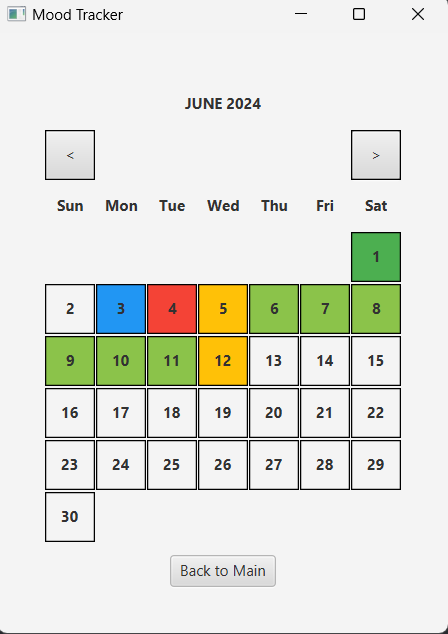

## Project Overview

This project opens up calendar where the user can select how they were feeling on a specific day and add a comment to go with that feeling. This data would be saved in a csv and be loaded back when the application is restarted.

## Dependencies

JavaFX runtime components are required to run this application
